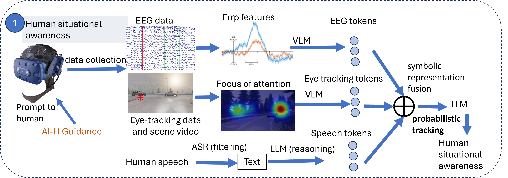
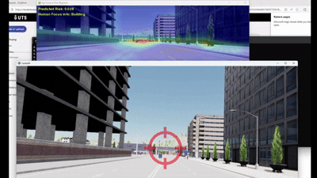

# Human AI symbolic fusion

## System Overview


## Demo
<p align="center">
  
</p>

## Setup
Install anaconda
```Shell
wget https://repo.anaconda.com/archive/Anaconda3-2020.11-Linux-x86_64.sh
bash Anaconda3-2020.11-Linux-x86_64.sh
source ~/.profile
```

Clone the repo and build the environment

```Shell
cd symbiotic_ai
conda create -n symbiotic_ai python=3.7
conda activate symbiotic_ai
pip3 install -r requirements.txt
```

## Download and setup CARLA 0.9.13
mkdir -p carla
cd carla

## Grab the simulator and Additional Maps packages
```Shell
wget https://tiny.carla.org/carla-0-9-13-linux -O CARLA_0.9.13.tar.gz
wget https://tiny.carla.org/additional-maps-0-9-13-linux -O AdditionalMaps_0.9.13.tar.gz
tar -xf CARLA_0.9.13.tar.gz
tar -xf AdditionalMaps_0.9.13.tar.gz
rm CARLA_0.9.13.tar.gz AdditionalMaps_0.9.13.tar.gz
cd ..
```

## Install the Python API
```Shell
easy_install carla/PythonAPI/carla/dist/carla-0.9.13-py3.7-linux-x86_64.egg
# (Alternatively) python3 -m pip install carla/PythonAPI/carla/dist/carla-0.9.13-py3.7-linux-x86_64.egg
```


## Scenarios
It is usually ideal to have curated experiments in the form of scenarios parsed through [ScenarioRunner](https://carla-scenariorunner.readthedocs.io/en/latest/).

For this purpose, we created a handy script that should be robust to some of the quirks of the existing implementation. This script ([`run_experiment.py`](../ScenarioRunner/run_experiment.py)) will automatically start recording for you AFTER the new map has been loaded, with a unique filename, all on a single client instance, so that you don't need to worry about a faulty recording or overwriting existing files. 

With `scenario_runner` v0.9.13, you should have already set these environment variables:
```bash
# on bash (Linux)
export CARLA_ROOT=/PATH/TO/carla/
export SCENARIO_RUNNER_ROOT=/PATH/TO/scenario_runner/
export PYTHONPATH=$PYTHONPATH:${CARLA_ROOT}/PythonAPI/carla/dist/carla-0.9.13-py3.7-linux-x86_64.egg                                           
export PYTHONPATH=$PYTHONPATH:${CARLA_ROOT}/PythonAPI/carla/agents
export PYTHONPATH=$PYTHONPATH:${CARLA_ROOT}/PythonAPI/carla
export PYTHONPATH=$PYTHONPATH:${CARLA_ROOT}/PythonAPI

# on Windows x64 Visual C++ Toolset
set CARLA_ROOT=C:PATH\TO\carla\
set SCENARIO_RUNNER_ROOT=C:PATH\TO\scenario_runner\
set PYTHONPATH=%PYTHONPATH%;%CARLA_ROOT%\PythonAPI\carla\dist\carla-0.9.13-py3.7-win-amd64.egg
set PYTHONPATH=%PYTHONPATH%;%CARLA_ROOT%\PythonAPI\carla\agents
set PYTHONPATH=%PYTHONPATH%;%CARLA_ROOT%\PythonAPI\carla
set PYTHONPATH=%PYTHONPATH%;%CARLA_ROOT%\PythonAPI
```
Then to run our demo examples, use this command:
```bash
# on bash (Linux)
cd $SCENARIO_RUNNER_ROOT # go to scenario-runner
./run_experiment.py --title "dreyevr_experiment" --route $SCENARIO_RUNNER_ROOT/srunner/data/routes_custom.xml $SCENARIO_RUNNER_ROOT/srunner/data/town05_scenarios.json 0

# on Windows x64 Visual C++ Toolset
cd %SCENARIO_RUNNER_ROOT% # go to scenario-runner
python run_experiment.py --title "dreyevr_experiment" --route %SCENARIO_RUNNER_ROOT%\srunner\data\routes_custom.xml %SCENARIO_RUNNER_ROOT%\srunner\data\town05_scenarios.json 0
```
Note that you can rename the experiment to anything with `--title "your_experiment"`, and the resulting recording file will include this title in its filename. 


